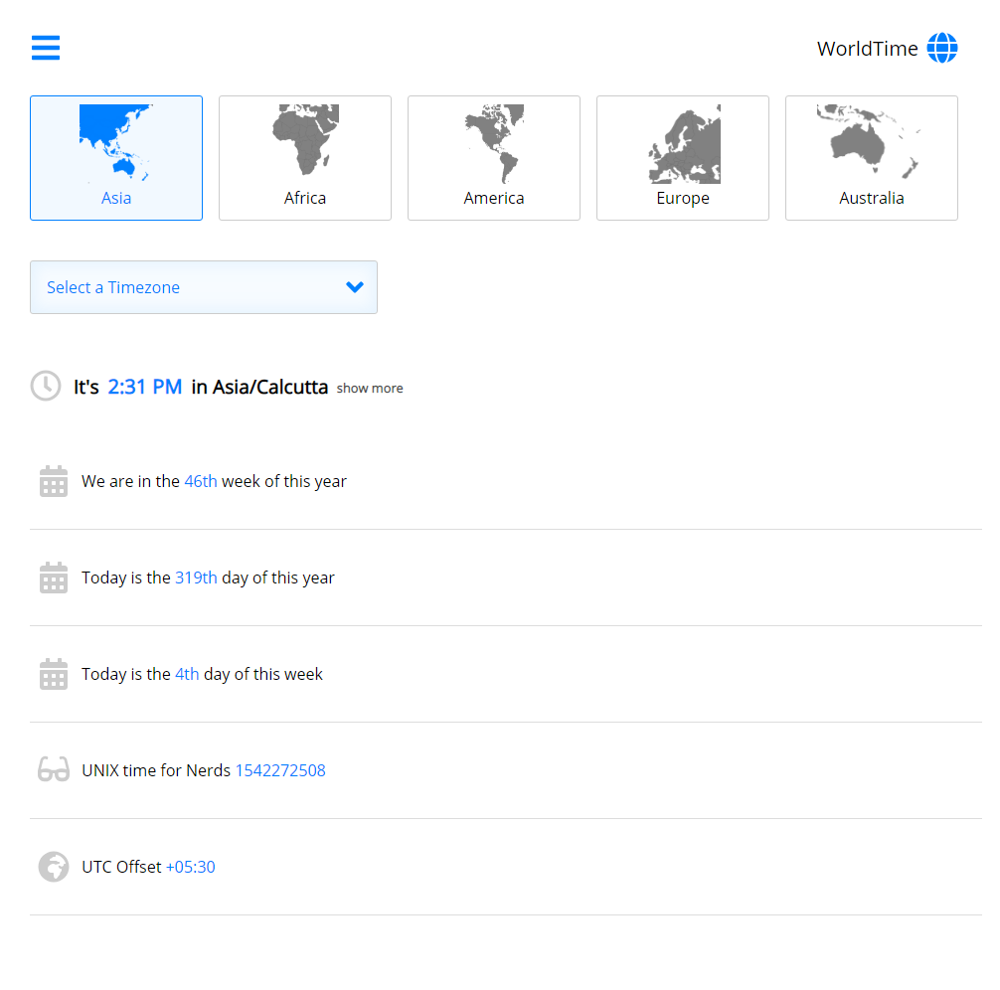

# react-worldtime

> Know your Timezones better.



## Development setup

This is a Monorepo comprising of both the Front end app as well as a miniature server that pulls the timezone information. The server is powered by [worldtimeapi.org](http://worldtimeapi.org/).

> Start the server

```sh
cd ./server
yarn install
yarn run dev
```

> Start the frontend App

```sh
cd ./client
yarn install
yarn run start
```

## Release History

* 0.0.1
  * First Release

## Meta

Your Name – [@prabhumurthy2](https://twitter.com/prabhumurthy2) – prabhu.m.murthy@gmail.com

Distributed under the MIT license. See ``LICENSE`` for more information.

[https://github.com/prabhuignoto](https://github.com/prabhuignoto/)

## Contributing

1. Fork it (<https://github.com/yourname/yourproject/fork>)
2. Create your feature branch (`git checkout -b feature/fooBar`)
3. Commit your changes (`git commit -am 'Add some fooBar'`)
4. Push to the branch (`git push origin feature/fooBar`)
5. Create a new Pull Request

[travis-url]: https://travis-ci.org/prabhuignoto/react-worldtime.svg?branch=master